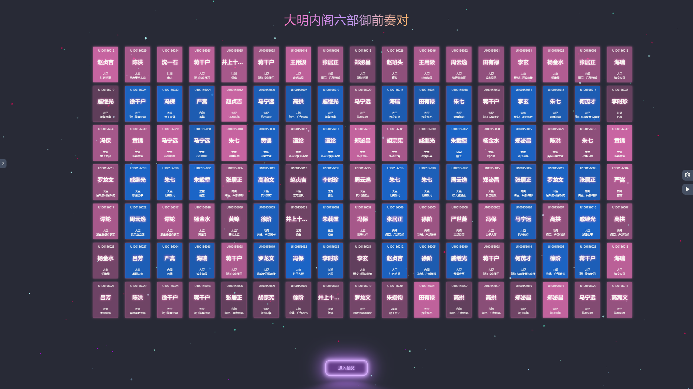
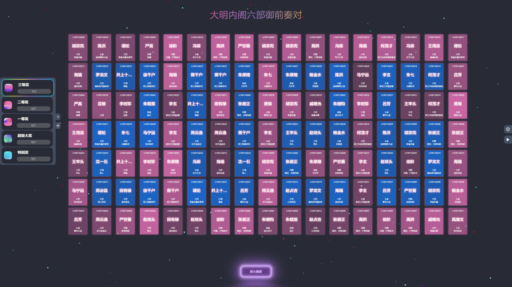
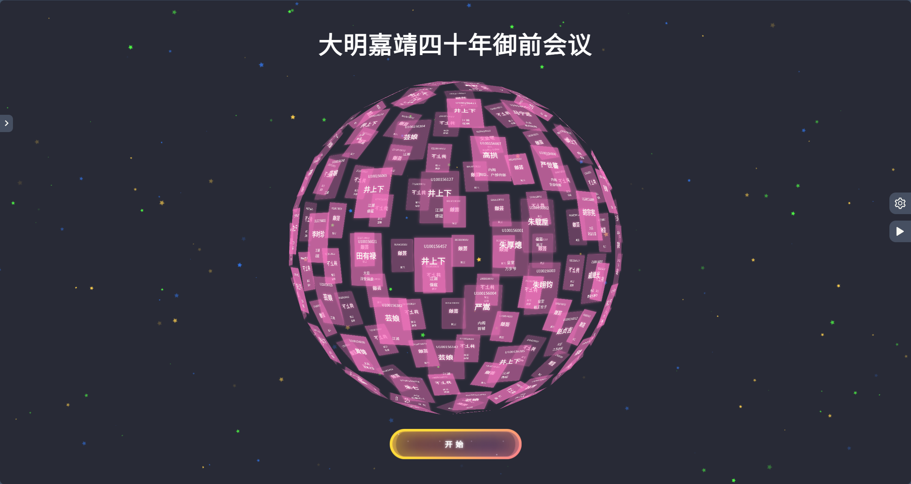
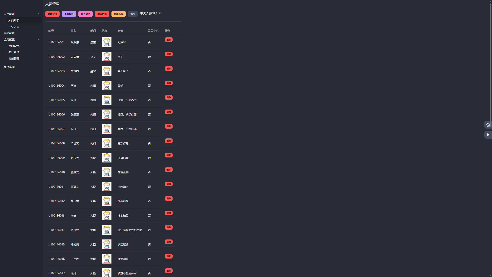
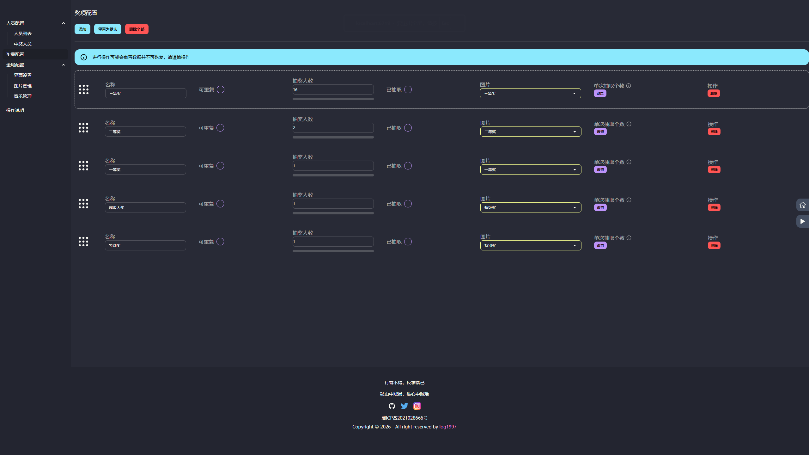
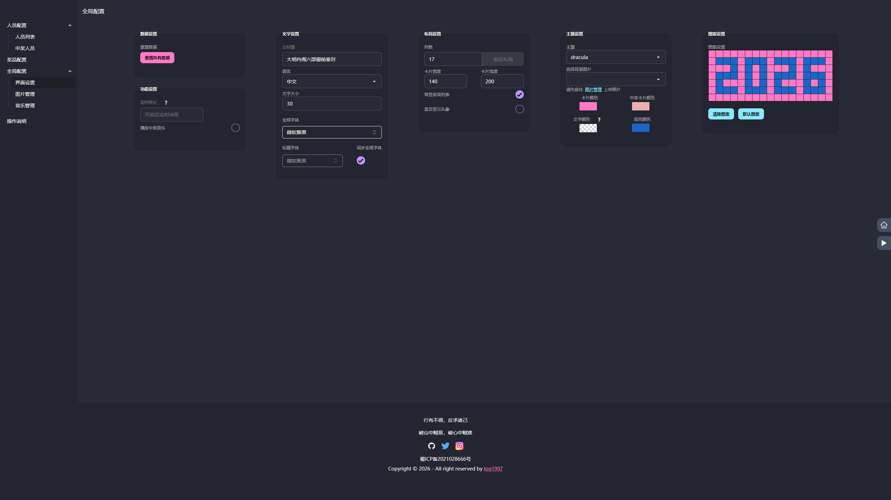
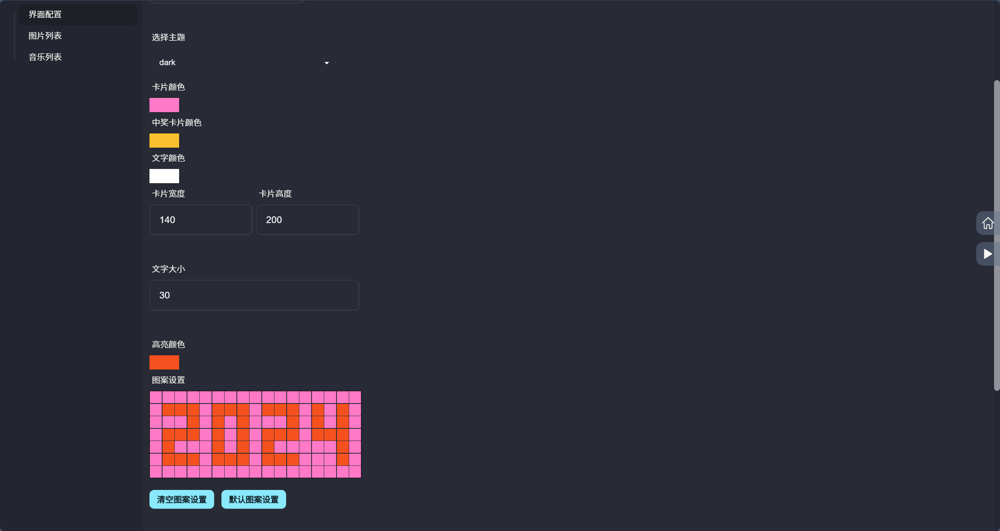

<div align="center">
    <a href="https://log1997.github.io/log-lottery/">
        
    </a>

# log-lottery 🚀🚀🚀🚀

[](https://github.com/LOG1997/log-lottery)
[](https://github.com/LOG1997/log-lottery)
[](https://github.com/LOG1997/log-lottery)
[](https://github.com/log1997)
[](https://github.com/log1997)
[](<https://hub.docker.com/r/log1997/log-lottery>)
[](https://github.com/LOG1997/log-lottery/releases)
[](https://github.com/LOG1997/log-lottery/releases)
[](https://github.com/LOG1997/log-lottery/commits/dev/)
</div>

log-lottery是一個可配置可定製化的抽獎應用，炫酷3D球體，可用於年會抽獎等活動，支持獎品、人員、界面、圖片音樂配置。

> 如果進入網站遇到圖片無法顯示或有報錯的情況，請先到【全局配置】-【界面配置】菜單中點擊【重設所有資料】按鈕清除資料後進行更新。

> 不支持內定功能

## 要求

使用PC端最新版Chrome或Edge瀏覽器。

訪問地址：

<https://lottery.to2026.xyz/log-lottery>

or

<https://log1997.github.io/log-lottery/>

開發倉促，若以上網站內容存在bug還請寬容。
如果想要訪問2025年12月31日前的版本，請前往：<https://to2026.xyz/log-lottery>

## TODO

- [x] 🕍 炫酷3D球體，年會抽獎必備，開箱即用
- [x] 💾 本地持久化存儲
- [x] 🎁 獎品獎項配置
- [x] 👱 抽獎名單設置管理
- [x] 🎼 播放背景音樂
- [x] 🖼️ excel表格導入人員名單、抽獎結果使用excel導出
- [x] 🎈 可增加臨時抽獎
- [x] 🧨 國際化多語言
- [x] 🍃 更換背景圖片
- [x] 🚅 添加docker構建
- [x] 😘 彈幕（開發中）
- [ ] 🧵 卡片組成多種形狀

...
需要更多功能或發現bug請留言[issues](https://github.com/LOG1997/log-lottery/issues)

## 詳細介紹

### 配置參與人員

於人員配置管理界面下載excel模板，按要求填好數據後導入即可。

### 配置獎項

於獎項配置管理界面添加獎項後，自定義修改名稱、抽取人數、是否全員參加、圖片顯示。

### 界面配置

可自定義配置標題、列數、卡片顏色、首頁圖案等。

### 圖片和音樂管理

上傳圖片或音樂即可，數據使用indexdb在瀏覽器本地進行存儲。

## 預覽

首頁
<div align="center">
    
    
</div>

抽獎
<div align="center">
    
    
</div>

配置
<div align="center">
    
    
    
    
</div>

圖片音樂配置

## 技術

- vue3
- threejs
- indexdb
- pinia
- daisyui

## 開發

安裝依賴

```bash
pnpm i
or
npm install
```

開發運行

```bash
pnpm dev
or
npm run dev
```

打包

```bash
pnpm build
or
npm run build
```

> 項目思路來源於 <https://github.com/moshang-xc/lottery>

## Docker支持

以下任意方式選一種即可

1. 拉取鏡像，從Docker Hub拉取鏡像[log-lottery](https://hub.docker.com/r/log1997/log-lottery)

    ```bash
    docker pull log1997/log-lottery:latest
    ```

    運行容器

    ```bash
    docker run -d --name log-lottery -p 9279:80 log1997/log-lottery:latest
    ```

2. 手動構建鏡像

    ```bash
    docker build -t log-lottery .
    ```

    運行容器

    ```bash
    docker run -d -p 9279:80 log-lottery
    ```

    容器運行成功後即可在本地通過<http://localhost:9279/log-lottery/>訪問

## 軟件安裝包

可前往[Releases](https://github.com/LOG1997/log-lottery/releases)下載。

目前只支持windows平臺使用，跨平臺安裝包暫不支持，如有需要請自行編譯，參照[貢獻文檔](https://github.com/LOG1997/log-lottery/blob/main/.github/CONTRIBUTING.md)

## 支持項目

<h3>💝 贊助支持</h3>

<p><em>如果您覺得 log-lottery 對您有幫助，歡迎贊助支持，您的支持是我們不斷前進的動力！</em></p>

<div>
 
</div>

<br>

## Contributors

Thanks to all the people who have contributed to this project!

[](https://github.com/LOG1997/log-lottery/graphs/contributors)

## Star History

[](https://star-history.com/#LOG1997/log-lottery&Date)

## License

[MIT](http://opensource.org/licenses/MIT)
